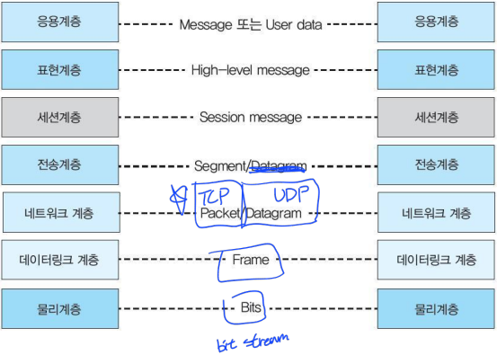

# 데이터 통신  

## 2장 OSI 참조모델  

### OSI 참조 모델
>**>OSI 계층 구조**  
>  

>**_PDU(Protocol Data Unit)_**  
>- 네트워크 구조에서 정보를 실어나르는 기본 단위
>- 각 계층마다 별도로 정의
>  
>  

### 물리 계층
>**역할**  
>  
>- 데이터링크 계층으로부터 <u>한 단위의 데이터(PDU)</u>를 받아 통신 링크를 따라 전송될 수 있는 형태로 변환
>- 비트흐름 &rarr; 전자기, 광신호
>- 매체를 통해 신호 전송

>**특성**  
>- 물리적 : DTE와 DCE 사이 물리적 연결에 관한 사항 (커넥터)
>- 전기적 : 전압에 따라 신호가 달라짐(전압 &uarr; &rarr; 속도 &uarr;)
>- 절차적 : 데이터 전송을 위한 사건으 순서 규정  
>   &rarr; 들어온 순서대로 나가니까 크게 상관 X

### 데이터링크 계층
>**특성**  
>- 헤더와 트레일러를 덧붙임
>   - 헤더 : 데이터 단위의 시작을 나타내는 표시와 **목적지 주소** 등 포함
>   - 트레일러 : 전송 에러 검출을 위한 코드
>- HDLC : 점대점(P2P), 다중점(Multipointing) 링크 상 반이중 통신과 전이중 통신 둘 다 지원하도록 설계된 프로토콜
>- 물리적 관점의 흐름, 접근 제어

>**역할**  
>- 접근제어 : 특정 순간 어느 시스템이 회선을 점유하는지 결정
>- 흐름제어 : 수신기의 노드에 도착하는 패킷의 양이 그 노드가 처리할 수 있는 양보다 많아지는것을 막아주는 기능
>   - Stop and wait, Sliding window 방식
>- 오류제어 : 오류 발생 프레임 검출 후 재전송 or 복원
>   &rarr; 보통 손실나면 재전송 후 조합
>- 동기화 : 프레임의 도착을 수신국에 알리기 위한 비트 포함
>   - 타이밍을 조절

### 네트워크 계층
>**특성**
>- 개방형 시스템에서 네트워크 연결 관리, 유지, 해제
>- 논리적 링크 구성
>- 경로배정 서비스
>   - **_스위칭_** : 1, 2계층에서도 동작 가능
>   - **_라우팅_** : 주고받는 길의 구성을 결정, 시공간 거리의 개념을 가짐(걸리는 시간을 기준으로 결정)
>       - 정적 라우팅 : 느리지만 보안 등의 이유로 경로를 고정
>       - 동적 라우팅 : 거리가 더 짧은 길로 보내는 것  

>  
>- 헤더
>   - 발신지의 논리 주소
>   - 목적지의 논리 주소 등
>- 역할
>   - 논리주소 지정(목적지 주소)
>   - 네트워크 단위로 라우팅
>   - **_주소변환 : 논리주소 &rarr; 물리주소_**
>       - 물리주소는 2계층이기때문에 3계층에서는 변환만 함

### 전송 계층
>**특성**  
>- 네트워크 서비스와 사용자 서비스 사이의 인터페이스
>   - 네트워크 서비스 : 1~3 계층
>   - 사용자 서비스 : 5~7 계층
>  

>**_역할_**
>- 종단간 메시지 전달
>- 서비스 포트 주소 지정
>- 분할과 재조합
>- 연결제어
>- 흐름제어
>- 오류제어

### 세션 계층
>**특성**
>- 특정 프로세스 사이에 세션이라 불리는 연결을 확립하고 유지, 동기화
>  

>**역할**
>- 세션 관리 : 프로세스 간 세션 연결, 관리
>- 동기화 : 데이터 단위 전송계층으로 전송하기 위한 순서 결정
>- 대화 제어 : 전이중, 반이중 같은 데이터 전송 방향 결정
>- 원활한 종료 : 데이터 교환이 세션 종료 전 완료되는 것을 보장

### 표현 계층
>**특성**  
>- 송수신자가 공통으로 이해할 수 있도록 데이터 표현 방식 변경  
>  

>**역할**
>- 변환 : 메시지의 형식을 전송에 사용할 수 있도록 변환
>- 암호화 : 데이터 보안을 위해 암호화, 해독 담당
>- 압축 : 전송의 효율성을 위해 압축 or 해제
>- 보안 : 패스워드와 로그인 코드 확인

### 응용계층
>  
